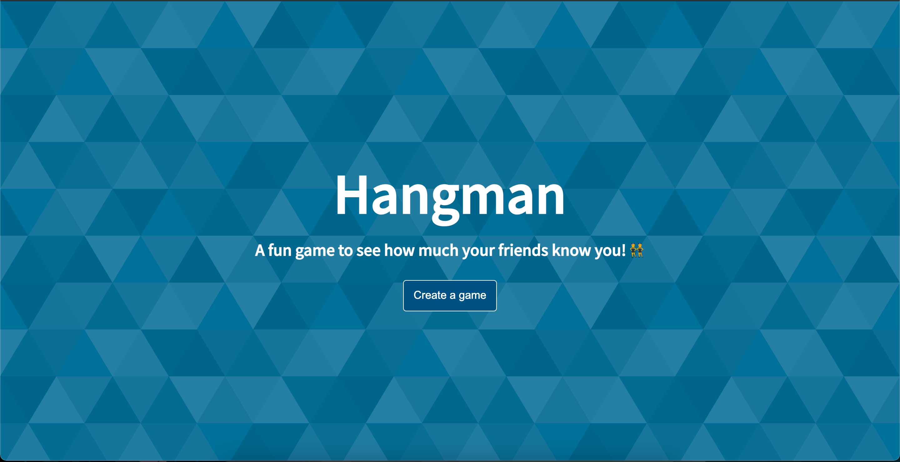
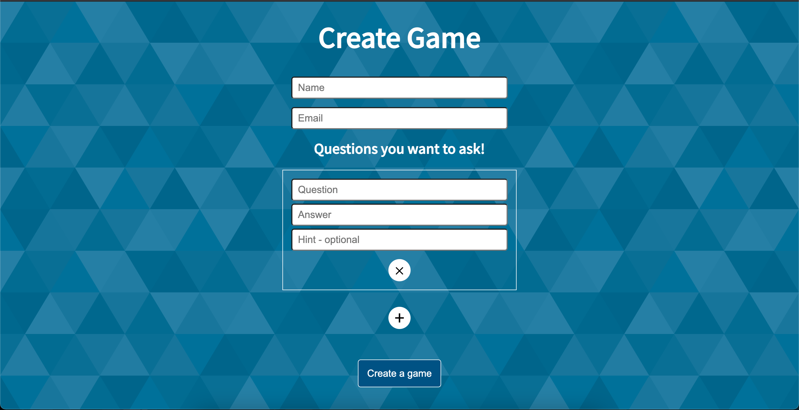
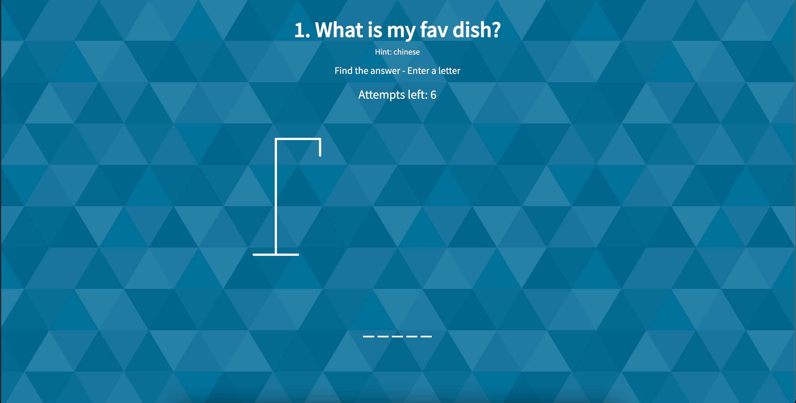

    
    
    

# Hangman

It is a fun game to see how well your friends know you. It is based on an actual Hangman game.

## Link 
 Link to the game - https://hangman-multiplayer.plxity.vercel.app/

## Demo 

## Tech Stack

- HTML
- CSS
- JavaScript
- ReactJS

